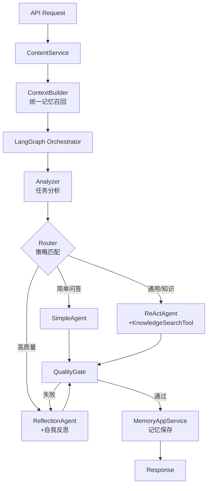

# ICCP LangChain - 多Agent内容创作平台

基于 **LangGraph + LangChain + DDD架构** 的多Agent智能内容创作平台，支持多板块 Prompt 优化、动态图编排路由、工具调用和可解释执行轨迹。

## 🎯 核心特性

### 架构特性（2024重构完成）
- ✅ **领域驱动设计（DDD）**：清晰的领域层、应用层、基础设施层和接口层
- ✅ **3个核心Agent**：SimpleAgent（快速问答）、ReActAgent（工具调用）、ReflectionAgent（深度反思）
- ✅ **策略模式路由**：配置驱动的路由规则，支持热重载
- ✅ **统一记忆系统**：ContextBuilder统一管理记忆召回，超时自动降级
- ✅ **RAG作为工具**：KnowledgeSearchTool集成到Agent工具链
- ✅ **渐进式迁移**：特性开关支持新旧架构共存

### 业务特性
- ✅ **多板块内容创作**：财经、人工智能、生活、科技、书籍、投资、成长等7+板块
- ✅ **LangGraph 动态编排**：记忆加载 → 路由 → Agent执行 → 质量门控 → 记忆保存
- ✅ **智能路由**：根据任务复杂度、知识需求、实时性自动选择Agent
- ✅ **工具调用**：网络搜索、事实核查、知识库检索
- ✅ **可插拔工具层**：内置工具 + 自定义函数 + MCP 桥接（可选开关）
- ✅ **直白犀利表达**：prompt 要求要点与痛点先行、言语直白
- ✅ **Web 界面**：响应式前端，可直接使用

## 技术栈

### 核心框架
- **后端框架**：FastAPI
- **图编排**：LangGraph（StateGraph、条件边）
- **Agent/工具**：LangChain（ReAct、Tools）
- **LLM**：OpenAI GPT-4 / 兼容API

### 架构模式
- **设计模式**：领域驱动设计（DDD）、策略模式、适配器模式
- **分层架构**：接口层（API）→ 应用层（Service）→ 领域层（Domain）→ 基础设施层（Infrastructure）

### 数据与存储
- **数据库**：SQLite（开发）/ PostgreSQL（生产）
- **向量数据库**：内存 / Milvus（可选）
- **缓存**：Redis（可选）

### 工具与集成
- **搜索工具**：Tavily Search、DuckDuckGo
- **外部工具接入**：ToolRegistry + MCP Bridge（HTTP Gateway，可选）
- **可观测性**：LangSmith（可选）

### 前端
- **技术栈**：React + Vite + TailwindCSS
- **UI组件**：shadcn/ui

## 快速开始

### 1. 安装依赖

```bash
pip install -r requirements.txt
```

（内含 `langgraph`，用于图编排；若本地未装过，需执行上述命令。）

### 2. 配置环境变量

复制 `.env.example` 为 `.env` 并填写配置：

```bash
cp .env.example .env
```

主要配置项：
- `OPENAI_API_KEY`: OpenAI API密钥（必需）
- `TAVILY_API_KEY`: Tavily搜索API密钥（可选，用于更好的搜索效果）
- `RAG_VECTOR_BACKEND`: RAG向量检索后端（`memory`/`milvus`，默认 `memory`）

### 3. 运行应用

```bash
python -m app.main
```

或使用uvicorn：

```bash
uvicorn app.main:app --reload --host 0.0.0.0 --port 8000
```

### 4. 访问界面

启动后访问：
- **前端界面**：http://localhost:8000/
- **API文档**：http://localhost:8000/docs
- **健康检查**：http://localhost:8000/health

### 5. 验证 LangGraph 编排（可选）

确认图构建与调用正常：

```bash
# 需已设置 OPENAI_API_KEY（.env 或环境变量）
python test_graph.py
```

## 使用说明

### Web界面使用

1. 打开浏览器访问 http://localhost:8000/
2. 选择内容板块（财经、AI、生活等）
3. 输入主题和可选要求
4. 选择内容长度和风格
5. 点击"开始创作"按钮
6. 等待AI生成内容（可能需要30秒-2分钟）
7. 查看生成的内容，可以点击"复制内容"按钮复制

### API使用

```bash
# 创建内容
curl -X POST "http://localhost:8000/api/v1/content/create" \
  -H "Content-Type: application/json" \
  -d '{
    "category": "ai",
    "topic": "AI发展趋势",
    "length": "medium",
    "style": "professional"
  }'

# 获取板块列表
curl "http://localhost:8000/api/v1/content/categories"

# 获取Agent建议
curl -X POST "http://localhost:8000/api/v1/content/suggest-agent" \
  -H "Content-Type: application/json" \
  -d '{
    "category": "finance",
    "topic": "2024年投资策略"
  }'
```

## 工具架构（重构后）

### 工具系统设计

- **KnowledgeSearchTool**：RAG 知识库检索（原 RAGAgent 降级为工具）
- **WebSearchTool**：网络搜索（Tavily / DuckDuckGo）
- **FactCheckTool**：事实核查
- **MCPBridge**：外部工具接入（可选）

### 架构特点

- 通过 `ToolRegistry` 统一注册，Agent 不感知底层实现
- `BaseTool.to_langchain_tool()` 支持字符串与 JSON 双输入
- 启用 `MCP_ENABLED=true` 可动态挂载 MCP 桥接工具
- 生产环境建议 MCP 走独立网关（鉴权、限流、审计）

### 使用示例

```python
# ReActAgent 自动注册工具
tools = [
    KnowledgeSearchTool(),  # RAG检索
    WebSearchTool(),        # 网络搜索
    FactCheckTool(),        # 事实核查
]
agent = ReActAgent(tools=tools)
```

## 项目结构（重构后 - DDD架构）

```
iccp-langchain/
├── app/
│   ├── main.py                    # FastAPI 入口 + 全局异常处理
│   ├── config/                    # 配置管理
│   │   ├── settings.py            # 环境变量配置
│   │   ├── routing_config.py      # 路由策略配置加载器
│   │   └── routing_config.yaml    # 路由规则配置文件
│   │
│   ├── domain/                    # 领域层（核心业务逻辑）
│   │   ├── models.py              # 领域模型（ContentTask, ContentResult, UserContext）
│   │   ├── interfaces.py          # 领域接口（BaseAgent, RoutingStrategy）
│   │   └── errors.py              # 统一错误模型
│   │
│   ├── services/                  # 应用层（业务编排）
│   │   ├── content_service.py     # 内容创作服务
│   │   ├── video_app_service.py   # 视频生成服务
│   │   ├── memory_app_service.py  # 记忆管理服务
│   │   └── context_builder.py     # 上下文构建器（统一记忆入口）
│   │
│   ├── agents/                    # Agent实现（基础设施层）
│   │   ├── graph.py               # LangGraph 状态机编排
│   │   ├── analyzer.py            # 任务分析器
│   │   ├── router_v2.py           # 策略模式路由器
│   │   ├── strategies.py          # 路由策略实现
│   │   ├── simple_agent.py        # 简单问答Agent
│   │   ├── react_agent.py         # ReAct Agent（工具调用）
│   │   └── reflection_agent.py    # Reflection Agent（深度反思）
│   │
│   ├── tools/                     # 工具系统
│   │   ├── knowledge_search.py    # 知识库检索工具（RAG）
│   │   ├── web_search.py          # 网络搜索工具
│   │   ├── fact_check.py          # 事实核查工具
│   │   └── registry.py            # 工具注册表
│   │
│   ├── adapters/                  # 适配器层（渐进式迁移）
│   │   └── legacy_adapter.py      # 旧接口适配器
│   │
│   ├── api/                       # 接口层（HTTP API）
│   │   └── v1/
│   │       ├── content.py         # 内容创作API
│   │       ├── video.py           # 视频生成API
│   │       ├── chat.py            # 聊天API
│   │       └── knowledge.py       # 知识库API
│   │
│   ├── memory/                    # 记忆系统（基础设施）
│   │   ├── manager.py             # 记忆管理器
│   │   ├── store.py               # 记忆存储
│   │   └── retriever.py           # 记忆检索
│   │
│   ├── rag/                       # RAG系统（基础设施）
│   │   ├── embeddings.py          # 向量嵌入
│   │   ├── vector_index.py        # 向量索引
│   │   └── knowledge_service.py   # 知识库服务
│   │
│   ├── categories/                # 板块系统
│   │   ├── config.py              # 板块配置
│   │   ├── loader.py              # Prompt加载器
│   │   └── prompts/               # Prompt模板
│   │
│   ├── models/                    # 数据模型（ORM）
│   │   ├── user.py                # 用户模型
│   │   ├── content.py             # 内容模型
│   │   └── memory.py              # 记忆模型
│   │
│   ├── db/                        # 数据库
│   ├── auth/                      # 认证授权
│   ├── llm/                       # LLM客户端
│   └── observability/             # 可观测性
│
├── tests/                         # 测试
│   ├── test_legacy_adapter.py     # 适配器测试
│   ├── test_feature_flag.py       # 特性开关测试
│   └── ...
│
├── docs/                          # 文档
│   ├── 架构重构总结.md
│   ├── 渐进式迁移指南.md
│   └── ...
│
├── frontend/                      # 前端应用
├── static/                        # 静态文件
├── requirements.txt
├── .env.example
└── README.md
```

### 架构分层说明

```
┌─────────────────────────────────────────┐
│      接口层 (Interface Layer)           │
│   FastAPI Routers / Pydantic DTOs       │
├─────────────────────────────────────────┤
│      应用层 (Application Layer)         │
│   ContentService / VideoService         │
│   MemoryAppService / ContextBuilder     │
├─────────────────────────────────────────┤
│      领域层 (Domain Layer)              │
│   ContentTask / ContentResult           │
│   UserContext / BaseAgent               │
├─────────────────────────────────────────┤
│   基础设施层 (Infrastructure Layer)     │
│   LangGraph / Agents / Tools            │
│   MemoryStore / VectorIndex / Database  │
└─────────────────────────────────────────┘
```

## 前端界面功能

- ✅ 美观的响应式设计
- ✅ 板块选择下拉框
- ✅ 主题和需求输入
- ✅ 内容长度和风格选择
- ✅ 实时加载状态显示
- ✅ 生成结果展示（包含Agent信息、工具使用、迭代次数）
- ✅ 一键复制功能
- ✅ 错误提示

## LangGraph 流程与路由策略（重构后）

### 执行流程



### 路由策略（配置驱动）

路由规则定义在 `app/config/routing_config.yaml`，支持热重载：

| 优先级 | 策略 | 触发条件 | 目标Agent |
|--------|------|----------|-----------|
| 10 | SimpleQAStrategy | 简单问答、闲聊 | SimpleAgent |
| 20 | KnowledgeStrategy | 需要知识库检索 | ReActAgent |
| 30 | RealtimeStrategy | 需要实时数据 | ReActAgent |
| 40 | HighQualityStrategy | 专业风格、长文 | ReflectionAgent |
| 100 | DefaultStrategy | 兜底策略 | ReActAgent |

### 3个核心Agent

| Agent | 职责 | 适用场景 |
|-------|------|----------|
| **SimpleAgent** | 快速问答、简单对话 | 闲聊、简单查询 |
| **ReActAgent** | 工具调用、推理行动 | 需要搜索、知识库、实时数据 |
| **ReflectionAgent** | 深度反思、质量优化 | 专业内容、长文、高质量要求 |

**重要变更**：
- ❌ 移除 `PlanSolveAgent`（功能合并到 ReflectionAgent）
- ❌ 移除 `RAGAgent`（RAG 降级为 KnowledgeSearchTool）
- ✅ 新增 `SimpleAgent`（快速响应简单请求）

## 渐进式迁移

项目支持新旧架构共存，通过特性开关控制：

```bash
# .env 文件
USE_NEW_ARCHITECTURE=false  # 使用旧架构（默认）
USE_NEW_ARCHITECTURE=true   # 使用新架构
```

### 迁移指南

详见：[docs/渐进式迁移指南.md](docs/渐进式迁移指南.md)

### 适配器模式

`LegacyAgentAdapter` 提供旧接口兼容：

```python
# 旧代码仍可工作
result = agent.execute(task_dict, context_dict)

# 新架构使用领域对象
result = agent.execute(ContentTask(...), ExecutionContext(...))
```

## 开发计划

### 已完成 ✅
- [x] 领域驱动设计（DDD）架构重构
- [x] 策略模式路由器
- [x] 统一记忆系统
- [x] RAG 工具化
- [x] 配置驱动路由规则
- [x] 渐进式迁移适配器
- [x] 数据库集成（SQLite/PostgreSQL）
- [x] 用户认证和授权
- [x] RAG系统（Milvus可选）

### 进行中 🚧
- [ ] 完整的属性测试覆盖
- [ ] 性能优化和监控
- [ ] 流式输出（实时显示生成过程）

### 计划中 📋
- [ ] Redis缓存优化
- [ ] 异步任务处理（Celery）
- [ ] 更多工具集成
- [ ] 多模态支持（图片、视频）

## 常见问题

### Q: 为什么生成内容很慢？
A: 内容生成需要调用LLM API，可能需要30秒-2分钟。如果使用了工具（如搜索），时间会更长。

### Q: 如何提高生成速度？
A: 
1. 使用更快的模型（如gpt-3.5-turbo）
2. 减少内容长度
3. 不使用需要实时数据的板块

### Q: 前端界面无法访问？
A: 确保：
1. 后端服务已启动（`python -m app.main`）
2. 访问 http://localhost:8000/（不是8000/docs）
3. 检查浏览器控制台是否有错误

### Q: API调用失败？
A: 检查：
1. OPENAI_API_KEY是否正确设置
2. 网络连接是否正常
3. API配额是否充足

## 许可证

MIT License
